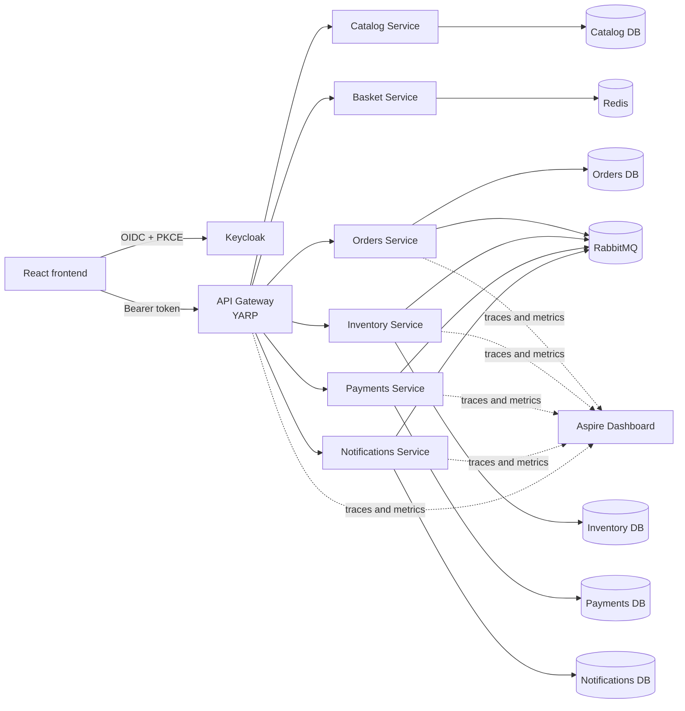
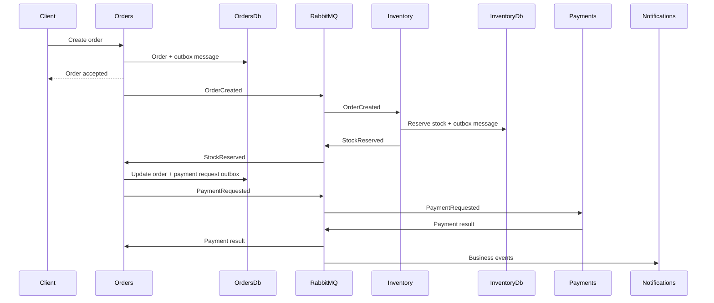

# Microservices Eshop

[](https://github.com/MBMor/MicroS_04_Eshop/actions/workflows/ci.yml)

A portfolio-grade microservices e-commerce system built with .NET 10, ASP.NET Core, React, PostgreSQL, Redis, RabbitMQ, Keycloak, Docker Compose and OpenTelemetry.

The project demonstrates practical microservice patterns including database-per-service, asynchronous messaging, transactional outbox, idempotent consumers, dead-letter queues, optimistic concurrency, JWT authentication, role-based authorization, distributed tracing and integration testing with Testcontainers.

## Project Goals

The primary goal of this project is to demonstrate production-oriented microservices development rather than only basic CRUD APIs.

The system focuses on:

- independently owned service data
- synchronous and asynchronous service communication
- eventual consistency
- failure recovery
- message delivery guarantees
- secure customer identity propagation
- operational visibility across service boundaries
- automated integration testing
- reproducible local infrastructure
- CI quality gates

## Technology Stack

### Backend

- .NET 10
- ASP.NET Core
- Entity Framework Core
- YARP Reverse Proxy
- PostgreSQL
- Redis
- RabbitMQ
- OpenTelemetry
- ASP.NET Core Health Checks
- Testcontainers
- xUnit

### Frontend

- React
- TypeScript
- Vite
- React Router
- Keycloak JavaScript adapter
- Vitest
- React Testing Library
- ESLint

### Infrastructure

- Docker Compose
- PostgreSQL 18
- Redis 8
- RabbitMQ 4 Management
- Keycloak 26
- .NET Aspire Dashboard
- GitHub Actions

## Architecture



## Services

| Component | Responsibility | Local URL |
|---|---|---|
| React frontend | Product catalog, basket, checkout, orders and authentication UI | `http://localhost:5173` |
| API Gateway | Public API entry point, routing, authentication and authorization | `http://localhost:5080` |
| Catalog Service | Product catalog management and queries | `http://localhost:5081` |
| Basket Service | Customer basket stored in Redis | `http://localhost:5082` |
| Orders Service | Order lifecycle, checkout and order ownership | `http://localhost:5083` |
| Inventory Service | Stock management and reservations | `http://localhost:5084` |
| Payments Service | Fake payment processing | `http://localhost:5085` |
| Notifications Service | Customer order and payment notifications | `http://localhost:5086` |
| Keycloak | OpenID Connect identity provider | `http://localhost:18080` |
| RabbitMQ Management | Broker administration interface | `http://localhost:15672` |
| Aspire Dashboard | Traces, metrics and structured logs | `http://localhost:18888` |

## Service Boundaries

### Catalog Service

Owns product information such as:

- product identifier
- name
- description
- price
- currency
- active status

Catalog data is publicly readable through the API Gateway.

### Basket Service

Stores customer baskets in Redis.

The basket owner is derived from the validated JWT `sub` claim. The service does not trust a customer identifier supplied by the frontend.

### Orders Service

Owns the order aggregate and checkout workflow.

Responsibilities include:

- loading the authenticated customer's basket
- validating checkout input
- creating an order
- storing an outbox message in the same database transaction
- applying stock reservation results
- applying payment results
- exposing customer-owned order queries

### Inventory Service

Owns stock quantities and stock reservations.

It consumes order events, reserves stock and publishes either:

- `StockReserved`
- `StockReservationFailed`

Optimistic concurrency prevents overselling during parallel reservations.

### Payments Service

Implements fake payment processing.

It consumes payment requests and publishes payment results through its transactional outbox.

### Notifications Service

Consumes business events and stores notifications for the affected customer.

Notification ownership is derived from message data produced by trusted backend services and exposed only to the authenticated customer.

## API Gateway

The API Gateway is implemented with YARP.

Responsibilities include:

- routing public API requests
- validating JWT access tokens
- validating issuer, audience, signature and expiration
- enforcing role-based authorization
- exposing public health endpoints
- forwarding authorized requests to backend services

### Authorization Matrix

| Route | Required access |
|---|---|
| `/api/v1/products` | Anonymous |
| `/api/v1/products/{...}` | Anonymous |
| `/api/v1/auth/me` | Authenticated user |
| `/api/v1/basket` | `customer` |
| `/api/v1/basket/{...}` | `customer` |
| `/api/v1/orders` | `customer` |
| `/api/v1/orders/{...}` | `customer` |
| `/api/v1/notifications` | `customer` |
| `/api/v1/notifications/{...}` | `customer` |
| `/api/v1/inventory-items` | `support` or `admin` |
| `/api/v1/inventory-items/{...}` | `support` or `admin` |
| `/api/v1/payments` | `support` or `admin` |
| `/api/v1/payments/{...}` | `support` or `admin` |

Protected downstream services validate bearer tokens independently, so direct access to a service port does not bypass authentication.

## Authentication and Authorization

The project uses Keycloak as its OpenID Connect provider.

The React frontend uses Authorization Code Flow with PKCE.

```text
React SPA
  → Keycloak authorization endpoint
  → authorization code
  → PKCE token exchange
  → access token
  → API Gateway
```

### Keycloak Realm

```text
eshop
```

### Clients

| Client | Type | Purpose |
|---|---|---|
| `eshop-frontend` | Public OpenID Connect client | React SPA authentication |
| `eshop-api` | Bearer-only audience | Backend API protection |

### Application Roles

| Role | Purpose |
|---|---|
| `customer` | Basket, checkout, orders and customer notifications |
| `support` | Operational inventory and payment access |
| `admin` | Administrative operational access |

### Local Users

| Username | Password | Role |
|---|---|---|
| `alice.customer` | `Alice123!` | `customer` |
| `sam.support` | `Support123!` | `support` |
| `anna.admin` | `Admin123!` | `admin` |

These users and passwords are intended only for local development.

Detailed identity documentation is available in:

```text
docs/identity.md
```

## Customer Ownership

Customer-owned resources use the validated JWT subject claim:

```text
sub
```

The system does not trust customer identifiers from:

- request bodies
- query parameters
- route parameters
- frontend-controlled custom headers

The previous local-development `X-Customer-Id` mechanism is not used as production authentication.

Orders Service forwards the original bearer token when it calls Basket Service. Basket Service then validates the same token independently.

## Messaging Architecture

RabbitMQ is used for asynchronous communication between services.

The messaging flow is based on durable topic exchanges, quorum queues and explicit routing keys.



## Transactional Outbox

Services do not publish business events directly inside database transactions.

Instead, a service stores:

1. the domain state change
2. the outgoing message

in the same database transaction.

A background worker later claims and publishes pending outbox messages.

Outbox processing includes:

- status transitions
- batch claiming
- claim ownership
- stale claim recovery
- retry handling
- publisher confirmations
- cleanup of old published messages
- protection against parallel publication

Typical states:

```text
Pending
Processing
Published
Failed
```

## Idempotent Consumers

RabbitMQ can deliver the same message more than once.

Consumers therefore store processed-message records with a unique key based on:

- message ID
- event type
- consumer name

A duplicate delivery is acknowledged without repeating the business operation.

This provides effectively-once business processing on top of at-least-once message delivery.

## Dead-Letter Queues

Permanent failures and messages exceeding their delivery limit are moved to dead-letter queues.

The integration tests cover:

- transient consumer failure
- permanent business failure
- delivery-limit exhaustion
- dead-letter routing
- duplicate message handling
- RabbitMQ outage and recovery

## Failure Handling

The messaging implementation distinguishes between:

### Transient failure

Examples:

- temporary database connectivity issue
- broker outage
- concurrent database update
- temporary dependency failure

The message is retried.

### Permanent failure

Examples:

- unknown business entity
- invalid event data
- unsupported business transition

The message is rejected and dead-lettered without unnecessary retry loops.

## Eventual Consistency

Order creation is not completed by one distributed database transaction.

Instead, the order progresses asynchronously through states such as:

```text
PendingStockReservation
StockReserved
StockReservationFailed
PaymentPending
Paid
PaymentFailed
Cancelled
```

Each service commits only its own database transaction and communicates state changes using events.

## Optimistic Concurrency

Inventory reservations use optimistic concurrency to prevent lost updates and overselling.

When concurrent operations modify the same inventory item:

1. one transaction succeeds
2. another detects a concurrency conflict
3. the failed operation reloads or retries according to the configured policy

The database remains the final authority for stock availability.

## Observability

The project uses OpenTelemetry for distributed observability.

It includes:

- structured logging
- correlation IDs
- W3C trace context
- distributed tracing
- custom messaging spans
- application metrics
- health checks
- Aspire Dashboard integration

### Trace Propagation

Trace context is propagated through:

- HTTP requests
- transactional outbox records
- RabbitMQ message headers
- consumer activities

A complete trace can connect:

```text
React
→ API Gateway
→ Orders Service
→ outbox publisher
→ RabbitMQ
→ Inventory consumer
→ Inventory outbox publisher
→ Orders consumer
→ Notifications consumer
```

### Custom Activities

Examples include:

```text
outbox.publish_batch
outbox.publish_message
rabbitmq.consume
```

### Correlation ID

The HTTP correlation header is:

```text
X-Correlation-Id
```

Correlation information is included in structured logs and propagated between services.

## Health Checks

Services expose:

```text
/health
```

Health checks are used for:

- local diagnostics
- Docker readiness
- integration-test startup coordination
- future orchestration probes

## Testing

The project contains multiple test layers.

### API Gateway Integration Tests

Tests verify:

- anonymous routes
- protected routes
- `401 Unauthorized`
- `403 Forbidden`
- customer role access
- support role access
- admin role access
- `/api/v1/auth/me`
- YARP request forwarding

The tests use:

- `WebApplicationFactory`
- an in-process test authentication scheme
- an in-process fake downstream Kestrel server

They do not require a running Keycloak instance.

Run:

```bash
dotnet test \
  tests/backend/integration/ApiGateway.IntegrationTests/ApiGateway.IntegrationTests.csproj
```

### Messaging Integration Tests

Tests use Testcontainers to start isolated:

- PostgreSQL
- RabbitMQ

Covered scenarios include:

- end-to-end order messaging
- outbox publication
- consumer idempotency
- duplicate messages
- transient failures
- permanent failures
- dead-letter queues
- delivery limits
- RabbitMQ outage recovery
- stale outbox claim recovery

Run:

```bash
dotnet test \
  tests/backend/integration/Eshop.Messaging.IntegrationTests/Eshop.Messaging.IntegrationTests.csproj
```

### Frontend Tests

Frontend authentication tests cover:

- anonymous route guards
- role-denied states
- authorized rendering
- login initiation
- bearer-token attachment
- `401` handling
- `403` handling
- `204 No Content` handling

Run:

```bash
cd src/frontend

npm ci --no-audit --no-fund
npm run typecheck
npm run lint
npm run test
npm run build
```

## CI

GitHub Actions runs independent backend and frontend jobs.

### Backend job

- restores .NET projects
- builds in Release configuration
- runs API Gateway integration tests
- runs messaging integration tests
- uploads test-result artifacts

### Frontend job

- installs dependencies with `npm ci`
- runs TypeScript type checking
- runs ESLint
- runs Vitest
- creates a production build

## Prerequisites

Install:

- .NET SDK defined in `global.json`
- Docker Desktop or Docker Engine
- Docker Compose
- Node.js 24
- Git

Optional:

- Visual Studio 2022 or newer
- DBeaver
- Git Bash
- PowerShell

## Repository Structure

```text
.
├── .github
│   └── workflows
├── docs
├── infrastructure
│   ├── keycloak
│   └── postgres
├── scripts
├── src
│   ├── backend
│   │   ├── gateways
│   │   ├── services
│   │   ├── shared
│   │   └── tools
│   └── frontend
├── tests
│   └── backend
│       └── integration
├── docker-compose.yml
├── Eshop.slnx
└── global.json
```

## Local Infrastructure

Docker Compose provides:

| Component | Host port |
|---|---:|
| PostgreSQL | `5432` |
| Redis | `6379` |
| RabbitMQ AMQP | `5672` |
| RabbitMQ Management | `15672` |
| Keycloak | `18080` |
| Aspire Dashboard | `18888` |
| OTLP gRPC | `4317` |
| OTLP HTTP | `4318` |
| React frontend | `5173` |

## Initial Setup

Clone the repository:

```bash
git clone https://github.com/MBMor/MicroS_04_Eshop.git
cd MicroS_04_Eshop
```

Validate Docker Compose:

```bash
docker compose config --quiet
```

Start the infrastructure:

```bash
docker compose up -d \
  postgres \
  redis \
  rabbitmq \
  keycloak \
  aspire-dashboard
```

Check container status:

```bash
docker compose ps
```

## Keycloak Realm Import

Keycloak imports the local `eshop` realm from:

```text
infrastructure/keycloak/eshop-realm.json
```

The import runs only when the realm does not already exist.

After changing the realm JSON, delete only the application realm and restart Keycloak. Do not delete the shared PostgreSQL volume solely to refresh Keycloak configuration.

See:

```text
infrastructure/keycloak/README.md
docs/identity.md
```

## Database Initialization

The PostgreSQL initialization scripts create separate databases for:

- Catalog Service
- Orders Service
- Inventory Service
- Payments Service
- Notifications Service
- Keycloak

Database-per-service ownership is maintained even though local development uses one PostgreSQL container.

## Running the Backend

The backend can be started from Visual Studio using the solution:

```text
Eshop.slnx
```

Alternatively, run services individually:

```bash
dotnet run \
  --project src/backend/services/CatalogService/CatalogService.csproj
```

```bash
dotnet run \
  --project src/backend/services/BasketService/BasketService.csproj
```

```bash
dotnet run \
  --project src/backend/services/OrdersService/OrdersService.csproj
```

```bash
dotnet run \
  --project src/backend/services/InventoryService/InventoryService.csproj
```

```bash
dotnet run \
  --project src/backend/services/PaymentsService/PaymentsService.csproj
```

```bash
dotnet run \
  --project src/backend/services/NotificationsService/NotificationsService.csproj
```

```bash
dotnet run \
  --project src/backend/gateways/ApiGateway/ApiGateway.csproj
```

## Running the Frontend

Using Docker:

```bash
docker compose up -d --build frontend
```

Or locally:

```bash
cd src/frontend

npm ci --no-audit --no-fund
npm run dev
```

Open:

```text
http://localhost:5173
```

## Local Administration

### RabbitMQ

URL:

```text
http://localhost:15672
```

Default local credentials:

```text
Username: eshop
Password: eshop_password
```

### Keycloak

Admin Console:

```text
http://localhost:18080/admin/
```

Default local administrator:

```text
Username: admin
Password: admin_password
```

### Aspire Dashboard

```text
http://localhost:18888
```

The local dashboard allows anonymous access and must not be exposed as-is in production.

## Build

Restore:

```bash
dotnet restore Eshop.slnx
```

Build:

```bash
dotnet build Eshop.slnx --no-restore
```

Frontend validation:

```bash
cd src/frontend

npm ci --no-audit --no-fund
npm run typecheck
npm run lint
npm run test
npm run build
```

## Run All Backend Tests

```bash
dotnet test Eshop.slnx
```

The messaging integration tests require Docker.

## Security Notes

This repository is configured for local development.

Before production deployment:

- use HTTPS everywhere
- run Keycloak in production mode
- replace development credentials
- use secret management
- disable anonymous Aspire Dashboard access
- restrict public service ports
- restrict Keycloak redirect URIs
- configure production hostnames
- configure reverse-proxy headers correctly
- configure backup and recovery
- configure monitoring and alerting
- review token and session lifetimes
- review rate limiting and abuse protection

## Documentation

| Document | Purpose |
|---|---|
| `docs/identity.md` | Authentication, authorization and Keycloak runbook |
| `infrastructure/keycloak/README.md` | Local Keycloak realm operation |
| `src/frontend/.env.example` | Frontend runtime configuration |
| `.env.example` | Infrastructure defaults |

## Design Decisions

### Why database per service?

Each service owns its data model and persistence lifecycle. Other services interact through HTTP or events rather than direct table access.

### Why RabbitMQ?

RabbitMQ provides durable asynchronous communication and supports routing, retries, acknowledgements, quorum queues and dead-lettering.

### Why transactional outbox?

A database transaction cannot atomically commit both PostgreSQL data and a RabbitMQ publish. The outbox stores the state change and outgoing event together, then publishes asynchronously.

### Why idempotent consumers?

At-least-once delivery means duplicates are possible. Consumers must detect previously processed messages before applying business effects.

### Why validate JWTs in downstream services?

Gateway validation alone is insufficient when service ports are reachable directly. Independent token validation provides defense in depth.

### Why use the JWT subject for ownership?

The `sub` claim is a stable identifier issued by the trusted identity provider. Usernames and emails may change and client-supplied identifiers can be forged.

### Why Authorization Code Flow with PKCE?

The React application is a public browser client and cannot safely store a client secret. PKCE protects the authorization-code exchange without requiring confidential frontend credentials.

## Current Scope

This is a portfolio and learning project.

Implemented:

- product catalog
- Redis-backed basket
- order creation
- inventory reservation
- fake payments
- notifications
- API Gateway
- Keycloak authentication
- role-based authorization
- transactional outbox
- idempotent consumers
- dead-letter queues
- optimistic concurrency
- distributed tracing
- metrics and structured logs
- integration testing
- frontend authentication tests
- CI quality gates

Potential future extensions:

- product administration UI
- support and admin frontend pages
- distributed rate limiting
- dedicated secret management
- Kubernetes deployment
- production Keycloak configuration
- contract testing
- load testing
- end-to-end browser testing
- deployment pipeline
- BFF-based browser authentication
