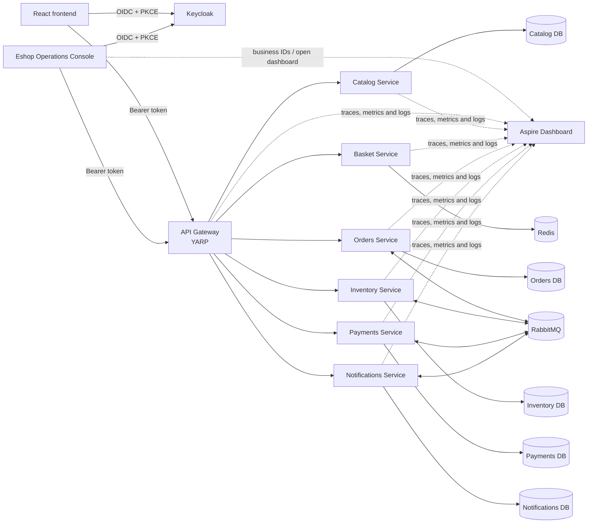
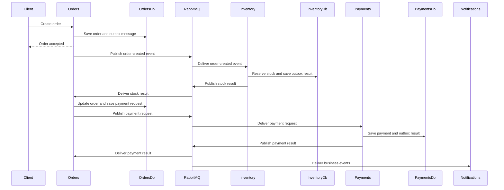

# Microservices Eshop

A portfolio-grade microservices e-commerce system built with .NET 10, ASP.NET Core, React, PostgreSQL, Redis, RabbitMQ, Keycloak, Docker Compose and OpenTelemetry.

The project demonstrates production-oriented microservice patterns including:

- database per service
- synchronous HTTP communication
- asynchronous event-driven workflows
- transactional outbox
- idempotent consumers
- quorum queues and dead-letter queues
- eventual consistency
- compensation after payment failure
- optimistic concurrency
- JWT authentication
- role-based authorization
- customer resource ownership
- API Gateway rate limiting
- distributed tracing
- integration testing with Testcontainers
- full-stack browser testing with Playwright
- reproducible container builds
- CI quality gates

## Project Goals

The primary goal of this project is to demonstrate practical microservices development beyond basic CRUD APIs.

The system focuses on:

- independently owned service data
- explicit service boundaries
- secure identity propagation
- synchronous and asynchronous communication
- eventual consistency
- failure classification and recovery
- reliable message delivery
- observable cross-service workflows
- automated testing at multiple levels
- reproducible local infrastructure
- Linux-compatible container builds
- continuous integration quality gates

## Technology Stack

### Backend

- .NET 10
- C#
- ASP.NET Core
- Entity Framework Core
- YARP Reverse Proxy
- PostgreSQL
- Redis
- RabbitMQ
- OpenTelemetry
- ASP.NET Core Health Checks
- Testcontainers
- xUnit

### Frontend

- React
- TypeScript
- Vite
- React Router
- Keycloak JavaScript adapter
- Vitest
- React Testing Library
- Playwright
- ESLint

### Infrastructure

- Docker Compose
- Docker Buildx
- Docker Bake
- PostgreSQL 18
- Redis 8
- RabbitMQ 4 Management
- Keycloak 26
- .NET Aspire Dashboard
- GitHub Actions

### Desktop Operations Console

- .NET 10
- WPF
- C#
- CommunityToolkit.Mvvm
- Generic Host
- Microsoft dependency injection and configuration
- HttpClientFactory
- OpenID Connect Authorization Code + PKCE
- xUnit
- Windows `win-x64` self-contained publishing

## Architecture


```mermaid
flowchart LR
    Browser[React frontend]
    Operations[Eshop Operations Console]
    Keycloak[Keycloak]

    Gateway[API Gateway<br/>YARP]

    Catalog[Catalog Service]
    Basket[Basket Service]
    Orders[Orders Service]
    Inventory[Inventory Service]
    Payments[Payments Service]
    Notifications[Notifications Service]

    Redis[(Redis)]

    CatalogDb[(Catalog DB)]
    OrdersDb[(Orders DB)]
    InventoryDb[(Inventory DB)]
    PaymentsDb[(Payments DB)]
    NotificationsDb[(Notifications DB)]

    RabbitMQ[(RabbitMQ)]
    Aspire[Aspire Dashboard]

    Browser -->|OIDC + PKCE| Keycloak
    Browser -->|Bearer token| Gateway
    Operations -->|OIDC + PKCE| Keycloak
    Operations -->|Bearer token| Gateway
    Operations -. business IDs / open dashboard .-> Aspire

    Gateway --> Catalog
    Gateway --> Basket
    Gateway --> Orders
    Gateway --> Inventory
    Gateway --> Payments
    Gateway --> Notifications

    Basket --> Redis

    Catalog --> CatalogDb
    Orders --> OrdersDb
    Inventory --> InventoryDb
    Payments --> PaymentsDb
    Notifications --> NotificationsDb

    Orders <--> RabbitMQ
    Inventory <--> RabbitMQ
    Payments <--> RabbitMQ
    Notifications <--> RabbitMQ

    Gateway -. traces, metrics and logs .-> Aspire
    Catalog -. traces, metrics and logs .-> Aspire
    Basket -. traces, metrics and logs .-> Aspire
    Orders -. traces, metrics and logs .-> Aspire
    Inventory -. traces, metrics and logs .-> Aspire
    Payments -. traces, metrics and logs .-> Aspire
    Notifications -. traces, metrics and logs .-> Aspire
```

## Services

| Component | Responsibility | Local URL |
|---|---|---|
| React frontend | Product catalog, basket, checkout, orders and authentication UI | `http://localhost:5173` |
| Eshop Operations Console | Windows support/admin operational client | Windows desktop application |
| API Gateway | Public API entry point, routing, authentication, authorization and rate limiting | `http://localhost:5080` |
| Catalog Service | Product catalog management and queries | `http://localhost:5081` |
| Basket Service | Customer basket stored in Redis | `http://localhost:5082` |
| Orders Service | Order lifecycle, checkout, ownership and workflow coordination | `http://localhost:5083` |
| Inventory Service | Stock management, reservation and compensation | `http://localhost:5084` |
| Payments Service | Fake payment processing | `http://localhost:5085` |
| Notifications Service | Customer order and payment notifications | `http://localhost:5086` |
| Keycloak | OpenID Connect identity provider | `http://localhost:18080` |
| RabbitMQ Management | Broker administration interface | `http://localhost:15672` |
| Aspire Dashboard | Traces, metrics and structured logs | `http://localhost:18888` |

## Service Boundaries

### Catalog Service

Catalog Service owns product information such as:

- product identifier
- SKU
- name
- description
- category
- price
- currency
- active status
- creation and update timestamps

Catalog data is publicly readable through the API Gateway.

Catalog management operations are protected separately from public product queries.

### Basket Service

Basket Service stores customer baskets in Redis.

The basket owner is derived from the validated JWT `sub` claim. The service does not trust a customer identifier supplied by the frontend.

Basket operations include:

- loading the current basket
- adding an item
- changing item quantity
- removing an item
- clearing the basket

### Orders Service

Orders Service owns the order aggregate and coordinates the checkout workflow.

Responsibilities include:

- loading the authenticated customer's basket
- validating checkout input
- creating an order
- persisting order items and totals
- storing outgoing messages in a transactional outbox
- applying inventory results
- requesting fake payment processing
- applying payment results
- requesting inventory compensation
- exposing customer-owned order queries

### Inventory Service

Inventory Service owns:

- stock quantities
- reserved quantities
- product-to-inventory mapping
- stock reservations
- stock releases

It consumes order workflow events, reserves stock and publishes either a success or failure result.

Optimistic concurrency protects inventory against lost updates and overselling during parallel reservations.

### Payments Service

Payments Service implements deterministic fake payment processing.

The checkout form supports fake payment methods used for development and testing:

- `test-success`
- `test-fail`

Payments Service consumes payment requests and publishes payment results through its transactional outbox.

### Notifications Service

Notifications Service consumes business events and stores notifications for the affected customer.

Notification ownership is derived from trusted backend event data and notifications are exposed only to the authenticated customer.

## Eshop Operations Console

The repository also contains a Windows WPF application for support and administrative operations:

`src/desktop/Eshop.Operations.Desktop`

The Operations Console complements the customer-facing React frontend.

It provides:

- anonymous Catalog inspection
- native OIDC sign-in using Authorization Code + PKCE
- support/admin protected operational navigation
- Orders inspection with bounded paging and lazy-loaded details
- Inventory inspection and stock-adjustment history
- admin-only stock adjustments with optimistic concurrency and idempotency
- Payments inspection
- Notifications inspection by Order ID, Customer ID, or Correlation ID
- cross-service troubleshooting navigation
- direct investigation by known business identifier
- runtime Diagnostics
- hand-off to the Aspire Dashboard for distributed trace inspection
- copy-friendly operational details and DataGrid cells

Operational navigation includes:

`Order -> Payments`

`Order -> Notifications`

`Order item -> Inventory`

`Payment -> Order`

`Notification -> Order`

The desktop application does not bypass service boundaries and does not call backend services directly. Business API traffic goes through the API Gateway.

Detailed documentation:

`docs/operations/operations-console.md`

## API Gateway

The API Gateway is implemented with YARP.

Responsibilities include:

- exposing the public API surface
- forwarding requests to backend services
- validating JWT access tokens
- validating issuer, audience, signature and expiration
- enforcing role-based authorization
- protecting internal service routes
- partitioning rate limits by identity or client
- exposing health endpoints
- propagating correlation information

### Authorization Matrix

| Route | Required access |
|---|---|
| `/api/v1/products` | Anonymous |
| `/api/v1/products/{...}` | Anonymous |
| `/api/v1/auth/me` | Authenticated user |
| `/api/v1/basket` | `customer` |
| `/api/v1/basket/{...}` | `customer` |
| `/api/v1/orders` | `customer` |
| `/api/v1/orders/{...}` | `customer` |
| `/api/v1/notifications` | `customer` |
| `/api/v1/notifications/{...}` | `customer` |
| `/api/v1/inventory-items` | `support` or `admin` |
| `/api/v1/inventory-items/{...}` | `support` or `admin` |
| `/api/v1/inventory-items/{id}/stock-adjustments` `POST` | `admin` |
| `/api/v1/payments` | `support` or `admin` |
| `/api/v1/payments/{...}` | `support` or `admin` |
| `/api/v1/operations/orders` | `support` or `admin` |
| `/api/v1/operations/orders/{...}` | `support` or `admin` |
| `/api/v1/operations/notifications` | `support` or `admin` |
| `/api/v1/operations/notifications/{...}` | `support` or `admin` |
| `/api/v1/operations/health` | `support` or `admin` |

Protected downstream services validate bearer tokens independently. Direct access to a service port therefore does not bypass authentication or authorization.

## Rate Limiting

The API Gateway applies partitioned rate limiting.

Partitions can be based on:

- authenticated user identity
- token subject
- client address for anonymous traffic

Checkout operations use a stricter policy than general customer API traffic.

Rate-limit responses include standard HTTP status information and can include retry metadata.

The E2E environment overrides production-oriented limits with higher test-only limits so that sequential browser scenarios do not interfere with each other.

## Authentication and Authorization

The project uses Keycloak as its OpenID Connect provider.

The React frontend uses Authorization Code Flow with PKCE.

```text
React SPA
  → Keycloak authorization endpoint
  → authorization code
  → PKCE token exchange
  → access token
  → API Gateway
```

### Keycloak Realm

```text
eshop
```

### Clients

| Client | Type | Purpose |
|---|---|---|
| `eshop-frontend` | Public OpenID Connect client | React SPA authentication |
| `eshop-api` | Backend API audience | Bearer-token API protection |

### Application Roles

| Role | Purpose |
|---|---|
| `customer` | Basket, checkout, orders and customer notifications |
| `support` | Operational inventory and payment access |
| `admin` | Administrative operational access |

### Local Users

| Username | Password | Role |
|---|---|---|
| `alice.customer` | `Alice123!` | `customer` |
| `sam.support` | `Support123!` | `support` |
| `anna.admin` | `Admin123!` | `admin` |

These users and passwords are intended only for local development and automated testing.

Detailed identity documentation is available in:

```text
docs/identity.md
```

## Customer Ownership

Customer-owned resources use the validated JWT subject claim:

```text
sub
```

The system does not trust customer identifiers from:

- request bodies
- query parameters
- route parameters
- frontend-controlled custom headers

The previous local-development `X-Customer-Id` mechanism is not used as production authentication.

Orders Service forwards the original bearer token when it calls Basket Service. Basket Service validates the same token independently and derives the customer identity from it.

## Messaging Architecture

RabbitMQ is used for asynchronous communication between services.

The messaging topology uses:

- durable topic exchanges
- explicit routing keys
- durable quorum queues
- publisher confirmations
- manual consumer acknowledgements
- dead-letter exchanges
- dead-letter queues
- bounded delivery attempts


```mermaid
sequenceDiagram
    participant Client
    participant Orders
    participant OrdersDb
    participant RabbitMQ
    participant Inventory
    participant InventoryDb
    participant Payments
    participant PaymentsDb
    participant Notifications

    Client->>Orders: Create order
    Orders->>OrdersDb: Save order and outbox message
    Orders-->>Client: Order accepted

    Orders->>RabbitMQ: Publish order-created event
    RabbitMQ->>Inventory: Deliver order-created event

    Inventory->>InventoryDb: Reserve stock and save outbox result
    Inventory->>RabbitMQ: Publish stock result
    RabbitMQ->>Orders: Deliver stock result

    Orders->>OrdersDb: Update order and save payment request
    Orders->>RabbitMQ: Publish payment request
    RabbitMQ->>Payments: Deliver payment request

    Payments->>PaymentsDb: Save payment and outbox result
    Payments->>RabbitMQ: Publish payment result
    RabbitMQ->>Orders: Deliver payment result

    RabbitMQ->>Notifications: Deliver business events
```

## Checkout Workflow

### Successful Checkout

```text
PendingStockReservation
  → PendingPayment
  → Confirmed
```

The workflow is:

1. Orders Service creates the order and its initial outbox message.
2. Inventory Service reserves stock.
3. Orders Service requests payment processing.
4. Payments Service returns a successful result.
5. Orders Service marks the order as `Confirmed`.
6. Notifications Service records customer notifications.

### Insufficient Stock

```text
PendingStockReservation
  → StockReservationFailed
```

The workflow stops before payment processing when Inventory Service cannot reserve all requested items.

### Failed Payment and Compensation

```text
PendingStockReservation
  → PendingPayment
  → PaymentFailed
  → Cancelled
```

`PaymentFailed` is an intermediate state.

After payment fails:

1. Orders Service records the failed payment result.
2. Orders Service requests release of the reserved stock.
3. Inventory Service releases the reservation.
4. Inventory Service publishes the release result.
5. Orders Service marks the order as `Cancelled`.

This is a saga-style compensation flow implemented through asynchronous events rather than a distributed database transaction.

## Transactional Outbox

Services do not publish business events directly inside database transactions.

Instead, a service stores:

1. the business state change
2. the outgoing message

in the same local PostgreSQL transaction.

A background worker later claims and publishes pending messages.

Outbox processing includes:

- batch claiming
- explicit claim ownership
- claim timestamps
- stale claim recovery
- retry tracking
- publisher confirmations
- published timestamps
- cleanup of old published records
- protection against concurrent publication
- structured logs
- tracing spans
- metrics

Typical outbox states are:

```text
Pending
Processing
Published
Failed
```

The pattern prevents a successful database commit from losing the corresponding outgoing event.

## Idempotent Consumers

RabbitMQ provides at-least-once delivery, so the same message can be delivered more than once.

Consumers store processed-message records with a unique business-processing key based on:

- message ID
- event type
- consumer name

A duplicate delivery is acknowledged without repeating the business operation.

This provides effectively-once business processing on top of at-least-once message delivery.

## Dead-Letter Queues

Permanent failures and messages exceeding their delivery limit are moved to dead-letter queues.

Dead-letter behavior covers:

- invalid event data
- unsupported business transitions
- unknown business entities
- delivery-limit exhaustion
- non-retryable consumer failures

Integration tests verify:

- transient consumer failure
- permanent business failure
- delivery-limit exhaustion
- dead-letter routing
- duplicate delivery handling
- broker outage recovery

## Failure Handling

The messaging implementation distinguishes between transient and permanent failures.

### Transient Failure

Examples include:

- temporary PostgreSQL connectivity issues
- temporary RabbitMQ outages
- concurrent database updates
- retryable `DbUpdateException`
- temporary dependency failures

Transient failures are retried according to the consumer or outbox policy.

### Permanent Failure

Examples include:

- unknown business entities
- invalid event data
- malformed messages
- unsupported state transitions
- non-retryable business-rule violations

Permanent failures are rejected and dead-lettered without unnecessary retry loops.

## Eventual Consistency

Order creation is not completed by one distributed transaction.

Each service commits only its own local transaction and communicates state changes through events.

An order can pass through the following states:

```text
PendingStockReservation
StockReservationFailed
PendingPayment
PaymentFailed
Confirmed
Cancelled
```

The API and frontend expose intermediate states so that the asynchronous workflow remains visible to the customer.

## Optimistic Concurrency

Inventory reservations use optimistic concurrency to prevent lost updates and overselling.

When concurrent operations modify the same inventory item:

1. one transaction succeeds
2. another detects a concurrency conflict
3. the failed operation is classified as retryable
4. the state is reloaded or processing is retried according to policy

PostgreSQL remains the final authority for stock availability.

## Observability

The project uses OpenTelemetry for distributed observability.

It includes:

- structured logging
- correlation IDs
- W3C trace context
- distributed tracing
- HTTP client instrumentation
- ASP.NET Core instrumentation
- Entity Framework Core instrumentation
- custom messaging activities
- application metrics
- health checks
- Aspire Dashboard integration

### Trace Propagation

Trace context is propagated through:

- incoming HTTP requests
- outgoing HTTP requests
- transactional outbox records
- RabbitMQ message headers
- consumer activities

A complete trace can connect:

```text
React frontend
  → API Gateway
  → Orders Service
  → Orders outbox publisher
  → RabbitMQ
  → Inventory consumer
  → Inventory outbox publisher
  → Orders consumer
  → Payments consumer
  → Orders consumer
  → Notifications consumer
```

### Custom Activities

Examples include:

```text
outbox.publish_batch
outbox.publish_message
rabbitmq.consume
```

### Correlation ID

The HTTP correlation header is:

```text
X-Correlation-Id
```

Correlation information is:

- accepted from valid incoming requests
- generated when missing
- returned in responses
- included in structured logs
- propagated between services
- stored with outgoing messages

## Health Checks

Services expose:

```text
/health
```

Health checks are used for:

- local diagnostics
- Docker readiness
- integration-test startup coordination
- E2E environment startup coordination
- future orchestration probes

The API Gateway also exposes health information for public infrastructure validation.

## Testing

The project uses multiple test layers so that business rules, infrastructure integrations, security boundaries, asynchronous workflows and browser behavior are verified independently.

## Domain Unit Tests

Domain unit tests cover business behavior without external infrastructure.

Covered areas include:

- order creation
- order state transitions
- invalid order transitions
- stock reservation rules
- insufficient stock handling
- stock release behavior
- optimistic inventory behavior
- fake payment results
- catalog product validation
- basket behavior
- notification state changes

Run:

```bash
dotnet test \
  tests/backend/unit/Eshop.Domain.UnitTests/Eshop.Domain.UnitTests.csproj
```

## API Gateway Integration Tests

API Gateway integration tests verify:

- anonymous routes
- protected routes
- `401 Unauthorized`
- `403 Forbidden`
- customer role access
- support role access
- admin role access
- `/api/v1/auth/me`
- YARP request forwarding
- internal endpoint protection
- unsupported HTTP methods
- partitioned rate limiting

The tests use:

- `WebApplicationFactory`
- an in-process test authentication scheme
- an in-process fake downstream Kestrel server

They do not require a running Keycloak instance.

Run:

```bash
dotnet test \
  tests/backend/integration/ApiGateway.IntegrationTests/ApiGateway.IntegrationTests.csproj
```

## Service API Integration Tests

Service API integration tests exercise real infrastructure through Testcontainers and HTTP endpoints through `WebApplicationFactory`.

Covered services include:

- Basket Service with Redis
- Catalog Service with PostgreSQL
- Orders Service with PostgreSQL
- Inventory Service with PostgreSQL
- Payments Service with PostgreSQL
- Notifications Service with PostgreSQL

The suites verify areas such as:

- request validation
- authenticated and anonymous access
- role-based authorization
- customer ownership
- persistence
- duplicate resources
- missing resources
- database constraints
- response serialization
- timestamp precision
- Redis basket behavior

Run an individual suite:

```bash
dotnet test \
  tests/backend/integration/CatalogService.IntegrationTests/CatalogService.IntegrationTests.csproj
```

Available service integration-test projects:

```text
tests/backend/integration/BasketService.IntegrationTests
tests/backend/integration/CatalogService.IntegrationTests
tests/backend/integration/OrdersService.IntegrationTests
tests/backend/integration/InventoryService.IntegrationTests
tests/backend/integration/PaymentsService.IntegrationTests
tests/backend/integration/NotificationsService.IntegrationTests
```

## Messaging Integration Tests

Messaging integration tests use Testcontainers to start isolated PostgreSQL and RabbitMQ instances.

Covered scenarios include:

- end-to-end order messaging
- transactional outbox publication
- stock reservation
- insufficient stock
- payment processing
- payment failure compensation
- stock release
- consumer idempotency
- duplicate messages
- transient failures
- permanent failures
- dead-letter queues
- delivery-limit exhaustion
- RabbitMQ outage recovery
- recovered connection handling
- stale outbox claim recovery
- concurrent outbox processing
- optimistic inventory concurrency
- outbox cleanup

Run:

```bash
dotnet test \
  tests/backend/integration/Eshop.Messaging.IntegrationTests/Eshop.Messaging.IntegrationTests.csproj
```

## Frontend Tests

Frontend tests use Vitest and React Testing Library.

Covered behavior includes:

- anonymous route guards
- role-denied states
- authorized rendering
- login initiation
- bearer-token attachment
- `401 Unauthorized` handling
- `403 Forbidden` handling
- `204 No Content` handling
- product catalog behavior
- basket interactions
- checkout form behavior
- order status rendering

Run:

```bash
cd src/frontend

npm ci --no-audit --no-fund
npm run typecheck
npm run lint
npm run test
npm run build
```

## Full-Stack Checkout E2E Tests

Playwright tests exercise the complete application through Chromium.

The E2E environment uses:

- PostgreSQL
- Redis
- RabbitMQ
- Keycloak
- React frontend
- API Gateway
- Catalog Service
- Basket Service
- Orders Service
- Inventory Service
- Payments Service
- Notifications Service

The startup script:

- removes a previous isolated E2E environment
- verifies that backend ports are available
- starts clean Docker infrastructure
- waits for Keycloak and the frontend
- restores the local .NET tools
- builds required backend projects
- applies EF Core migrations
- initializes RabbitMQ topology
- seeds deterministic products and inventory
- starts all backend processes
- checks process liveness
- waits for health endpoints
- verifies a seeded product through the frontend proxy
- writes backend logs under `artifacts/e2e`

Covered browser scenarios:

1. successful checkout reaches `Confirmed`
2. insufficient stock reaches `StockReservationFailed`
3. failed payment releases reserved stock and reaches `Cancelled`

The browser scenarios:

- authenticate through the real Keycloak login page
- use the React UI
- call services through the API Gateway
- use real PostgreSQL, Redis and RabbitMQ infrastructure
- run sequentially to avoid sharing one customer basket concurrently
- collect traces, videos and screenshots on failure

### Start the E2E Environment

From the repository root:

```bash
./scripts/e2e/start-stack.sh
```

### Run All Browser Tests

From the repository root:

```bash
npm test --prefix tests/e2e
```

Or from `tests/e2e`:

```bash
npm test
```

### Run Only Failure-Path Scenarios

```bash
npx playwright test \
  tests/e2e/specs/checkout-failure-paths.spec.ts
```

When already inside `tests/e2e`:

```bash
npx playwright test \
  specs/checkout-failure-paths.spec.ts
```

### Stop the E2E Environment

```bash
./scripts/e2e/stop-stack.sh
```

The stop script:

- terminates tracked backend process trees
- removes the E2E PID file
- stops Docker Compose services
- removes isolated E2E volumes
- removes orphaned containers

### E2E Diagnostics

Playwright and service diagnostics are written under:

```text
artifacts/e2e/
```

The diagnostics can include:

- Playwright HTML report
- screenshots
- videos
- traces
- error context
- backend service logs

## Continuous Integration

GitHub Actions validates the repository through dependent quality stages.

```text
Backend ──┐
          ├── Container images ── Checkout E2E
Frontend ─┘
```

The workflow runs on:

- pushes to `main`
- pull requests targeting `main`
- manual workflow dispatch

Concurrent runs for the same branch are grouped and an older in-progress run can be cancelled when a newer commit is pushed.

## Backend CI Job

The backend job:

- sets up the .NET SDK defined in `global.json`
- verifies Docker availability
- restores backend and test projects
- builds in Release configuration
- applies repository compiler and analyzer rules
- runs domain unit tests
- runs API Gateway integration tests
- runs all service API integration tests
- runs messaging integration tests
- produces `.trx` result files
- uploads backend test-result artifacts

## Desktop CI Job

The desktop job runs on Windows.

It:

- restores desktop test and publish dependencies
- builds desktop tests with warnings treated as errors
- runs the xUnit desktop test suite
- publishes a self-contained `win-x64` application
- validates the published application startup
- verifies required publish files
- generates SHA-256 checksums
- verifies artifact checksums
- verifies build provenance against the Git commit
- uploads the Windows desktop application artifact

Published artifact:

`eshop-operations-desktop-win-x64`

## Frontend CI Job

The frontend job:

- sets up Node.js 24
- installs dependencies with `npm ci`
- runs TypeScript type checking
- runs ESLint
- runs Vitest
- creates a production frontend build

## Container Image CI Job

The container job runs after successful backend and frontend jobs.

It:

- configures Docker Buildx
- validates the Docker Compose configuration
- validates the Docker Bake definition
- builds all application container images
- verifies Linux-compatible and reproducible builds

## Checkout E2E CI Job

The Checkout E2E job runs after the previous quality gates.

It:

- installs the required .NET and Node.js versions
- installs Playwright dependencies
- installs Chromium
- starts the isolated full-stack E2E environment
- runs all checkout browser scenarios
- always stops the environment
- uploads Playwright diagnostics
- uploads backend service logs

A cancelled browser-installation step caused by a newer workflow run is an infrastructure cancellation, not an application E2E failure.

## Prerequisites

Install:

- .NET SDK defined in `global.json`
- Docker Desktop or Docker Engine
- Docker Compose
- Node.js 24
- Git

Optional tools:

- Visual Studio 2022 or newer
- Visual Studio Code
- DBeaver
- Git Bash
- PowerShell

The E2E shell scripts support Linux and Git Bash on Windows.

## Repository Structure

```text
.
├── .config
│   └── dotnet-tools.json
├── .github
│   └── workflows
│       └── ci.yml
├── docs
│   ├── architecture
│   ├── operations
│   └── testing
├── infrastructure
│   ├── keycloak
│   └── postgres
├── scripts
│   └── e2e
│       ├── start-stack.sh
│       └── stop-stack.sh
├── src
│   ├── backend
│   │   ├── gateways
│   │   │   └── ApiGateway
│   │   ├── services
│   │   │   ├── BasketService
│   │   │   ├── CatalogService
│   │   │   ├── InventoryService
│   │   │   ├── NotificationsService
│   │   │   ├── OrdersService
│   │   │   └── PaymentsService
│   │   ├── shared
│   │   └── tools
│   │       └── RabbitMq.TopologyInitializer
│   ├── desktop
│   │   └── Eshop.Operations.Desktop
│   └── frontend
├── tests
│   ├── backend
│   │   ├── integration
│   │   └── unit
│   ├── desktop
│   ├── e2e
│   │   ├── specs
│   │   │   ├── checkout-failure-paths.spec.ts
│   │   │   └── checkout-success.spec.ts
│   │   ├── package-lock.json
│   │   ├── package.json
│   │   └── playwright.config.ts
│   └── frontend
├── infrastructure
│   ├── keycloak
│   ├── postgres
│   └── dev-data
│       ├── keycloak
│       │   └── eshop-realm.json
│       ├── catalog_db.sql
│       ├── inventory_db.sql
│       ├── notifications_db.sql
│       ├── orders_db.sql
│       └── payments_db.sql
├── .dockerignore
├── .editorconfig
├── .env.example
├── .gitattributes
├── .gitignore
├── Directory.Build.props
├── Dockerfile
├── Eshop.slnx
├── README.md
├── docker-bake.hcl
├── docker-compose.e2e.yml
├── docker-compose.yml
└── global.json
```

## Local Infrastructure

Docker Compose provides the following local components:

| Component | Host port |
|---|---:|
| PostgreSQL | `5432` |
| Redis | `6379` |
| RabbitMQ AMQP | `5672` |
| RabbitMQ Management | `15672` |
| Keycloak | `18080` |
| Aspire Dashboard | `18888` |
| OTLP gRPC | `4317` |
| OTLP HTTP | `4318` |
| React frontend | `5173` |

Backend services use ports `5080` through `5086` when started locally.

## Initial Setup

Clone the repository:

```bash
git clone https://github.com/MBMor/MicroS_04_Eshop.git
cd MicroS_04_Eshop
```

Validate Docker Compose:

```bash
docker compose config --quiet
```

Start the infrastructure required by locally running backend services:

```bash
docker compose up -d \
  postgres \
  redis \
  rabbitmq \
  keycloak \
  aspire-dashboard
```

Check container status:

```bash
docker compose ps
```

To build and start the complete Compose environment:

```bash
docker compose up -d --build
```

## Keycloak Realm Import

Keycloak imports the local `eshop` realm from the repository infrastructure configuration.

The realm defines:

- frontend and API clients
- application roles
- local development users
- redirect URIs
- audience configuration

The import runs only when the realm does not already exist.

After changing the realm definition, delete the application realm and restart Keycloak. Do not delete the shared PostgreSQL volume solely to refresh Keycloak configuration unless a completely clean environment is required.

See:

```text
infrastructure/keycloak/README.md
docs/identity.md
```

## Database Initialization

The PostgreSQL initialization scripts create separate databases for:

- Catalog Service
- Orders Service
- Inventory Service
- Payments Service
- Notifications Service
- Keycloak

Database-per-service ownership is maintained even though local development uses one PostgreSQL container.

Each service has its own:

- connection string
- EF Core DbContext
- migration history
- entity model
- persistence lifecycle

## Running the Backend

The backend can be started from Visual Studio using:

```text
Eshop.slnx
```

Services can also be started individually.

### Catalog Service

```bash
dotnet run \
  --project src/backend/services/CatalogService/CatalogService.csproj
```

### Basket Service

```bash
dotnet run \
  --project src/backend/services/BasketService/BasketService.csproj
```

### Orders Service

```bash
dotnet run \
  --project src/backend/services/OrdersService/OrdersService.csproj
```

### Inventory Service

```bash
dotnet run \
  --project src/backend/services/InventoryService/InventoryService.csproj
```

### Payments Service

```bash
dotnet run \
  --project src/backend/services/PaymentsService/PaymentsService.csproj
```

### Notifications Service

```bash
dotnet run \
  --project src/backend/services/NotificationsService/NotificationsService.csproj
```

### API Gateway

```bash
dotnet run \
  --project src/backend/gateways/ApiGateway/ApiGateway.csproj
```

## Running the Operations Console

The WPF Operations Console requires Windows.

Start the local infrastructure and backend services first.

Then run:

```bash
dotnet run \
  --project src/desktop/Eshop.Operations.Desktop/Eshop.Operations.Desktop.csproj
```

The application validates its configuration during startup.
The desktop communicates with application APIs only through the configured API Gateway.
Operational sections require a support or admin Keycloak user.
Catalog remains available anonymously.
For observability troubleshooting, configure the Aspire Dashboard URL and use:

`Diagnostics -> Observability -> Open Aspire dashboard`

See:

`docs/operations/operations-console.md`
`docs/operations/observability-troubleshooting.md`

## Running the Frontend

Using Docker:

```bash
docker compose up -d --build frontend
```

Or locally:

```bash
cd src/frontend

npm ci --no-audit --no-fund
npm run dev
```

Open:

```text
http://localhost:5173
```

## Local Administration

### RabbitMQ

Management UI:

```text
http://localhost:15672
```

Default local credentials:

```text
Username: eshop
Password: eshop_password
```

### Keycloak

Admin Console:

```text
http://localhost:18080/admin/
```

Default local administrator:

```text
Username: admin
Password: admin_password
```

### Aspire Dashboard

```text
http://localhost:18888
```

The local dashboard allows anonymous access and must not be exposed as-is in production.

## Build

Restore the backend solution:

```bash
dotnet restore Eshop.slnx
```

Build:

```bash
dotnet build \
  Eshop.slnx \
  --configuration Release \
  --no-restore
```

Validate the frontend:

```bash
cd src/frontend

npm ci --no-audit --no-fund
npm run typecheck
npm run lint
npm run test
npm run build
```

Validate Docker Compose:

```bash
docker compose config --quiet
```

Validate Docker Bake:

```bash
docker buildx bake \
  --file docker-bake.hcl \
  --print
```

Build all application images:

```bash
docker buildx bake \
  --file docker-bake.hcl
```

## Run All Backend Tests

```bash
dotnet test \
  Eshop.slnx \
  --configuration Release
```

Testcontainers-based integration tests require a running Docker engine.

## Security Notes

This repository is configured for local development and portfolio demonstration.

Before a production deployment:

- use HTTPS everywhere
- run Keycloak in production mode
- replace all development credentials
- use a secret-management service
- disable anonymous Aspire Dashboard access
- restrict public service ports
- expose backend services only through trusted network boundaries
- restrict Keycloak redirect URIs
- configure production hostnames
- configure reverse-proxy forwarded headers
- configure database backup and recovery
- configure monitoring and alerting
- review access-token and session lifetimes
- review rate-limiting policies
- apply dependency and container vulnerability scanning
- configure production certificate management
- define deployment rollback procedures

The fake payment implementation must not be replaced by a real payment provider without additional security, compliance and idempotency controls.

## Documentation

| Document | Purpose |
|---|---|
| `README.md` | Project overview, architecture, testing and local setup |
| `docs/operations/operations-console.md` | WPF Operations Console architecture, workflows and usage |
| `docs/operations/observability-troubleshooting.md` | Aspire/OpenTelemetry distributed troubleshooting runbook |
| `docs/identity.md` | Authentication, authorization and Keycloak runbook |
| `infrastructure/keycloak/README.md` | Local Keycloak realm operation |
| `docs/testing/test-strategy.md` | Test strategy |
| `docs/testing/quality-risk-register.md` | Quality risks |
| `docs/testing/traceability-matrix.md` | Requirement/risk/test traceability |
| `docs/testing/testrail-ci-integration.md` | Automated TestRail reporting |
| `docs/testing/quality-gate-policy.md` | CI quality gates |
| `src/frontend/.env.example` | Frontend runtime configuration |
| `.env.example` | Infrastructure defaults |

## Design Decisions

### Why Database per Service?

Each service owns its data model and persistence lifecycle.

Other services interact through HTTP APIs or events rather than directly reading or modifying another service's tables.

This preserves service autonomy and prevents a shared database from becoming an implicit monolith.

### Why RabbitMQ?

RabbitMQ provides durable asynchronous communication with support for:

- topic routing
- acknowledgements
- publisher confirmations
- quorum queues
- bounded redelivery
- dead-lettering

It allows order processing to continue through asynchronous service-owned transactions.

### Why Transactional Outbox?

A PostgreSQL transaction cannot atomically commit both database state and a RabbitMQ publish.

The transactional outbox stores the state change and outgoing message together. A background worker publishes the message after the transaction commits.

### Why Idempotent Consumers?

At-least-once delivery means duplicates are possible.

Consumers must detect previously processed messages before applying business effects such as:

- reserving stock
- creating a payment
- changing an order state
- creating a notification

### Why Validate JWTs in Downstream Services?

Gateway validation alone is insufficient when service ports are reachable directly or when internal network assumptions are violated.

Independent validation in protected services provides defense in depth.

### Why Use the JWT Subject for Ownership?

The `sub` claim is a stable identifier issued by the trusted identity provider.

Usernames and email addresses may change. Client-supplied identifiers can be forged.

### Why Authorization Code Flow with PKCE?

The React application is a public browser client and cannot securely store a client secret.

PKCE protects the authorization-code exchange without requiring a confidential frontend credential.

### Why Eventual Consistency?

A distributed transaction across Orders, Inventory, Payments and Notifications would tightly couple services and infrastructure.

The system instead uses local transactions and asynchronous events, with explicit intermediate states and compensation.

### Why Optimistic Concurrency?

Inventory writes are expected to be short and conflicts are exceptional.

Optimistic concurrency avoids long-held distributed locks while ensuring that the database detects conflicting updates.

### Why Full-Stack E2E Tests?

Unit and integration tests validate components in isolation, but they do not fully prove that:

- Keycloak login works in a browser
- the frontend sends the correct bearer token
- Gateway routing is correct
- Redis basket state is connected to checkout
- RabbitMQ events complete the order workflow
- compensation reaches its final state

Playwright tests cover these critical cross-component paths.

## Project Status

The planned portfolio scope of the project is complete.

Implemented capabilities include:

- database-per-service architecture
- React single-page frontend
- API Gateway with YARP
- Keycloak authentication with Authorization Code Flow and PKCE
- JWT validation in the Gateway and protected downstream services
- customer, support and administrator authorization policies
- partitioned API rate limiting
- Redis-backed customer baskets
- transactional outbox processing
- idempotent RabbitMQ consumers
- quorum queues and dead-letter queues
- bounded retry and permanent-failure classification
- order, inventory and payment saga-style workflow
- stock compensation after payment failure
- optimistic inventory concurrency
- structured logging and correlation IDs
- OpenTelemetry tracing and metrics
- Aspire Dashboard integration
- domain unit tests
- API and infrastructure integration tests
- messaging failure-path integration tests
- full-stack Playwright checkout tests
- Docker Compose validation
- Docker image build validation
- GitHub Actions quality gates

The project is intended as a production-oriented portfolio demonstration.

It does not include:

- production deployment infrastructure
- Kubernetes manifests
- cloud-provider resources
- real payment-provider integration
- production secret management
- production monitoring and alerting configuration
- production disaster-recovery automation
